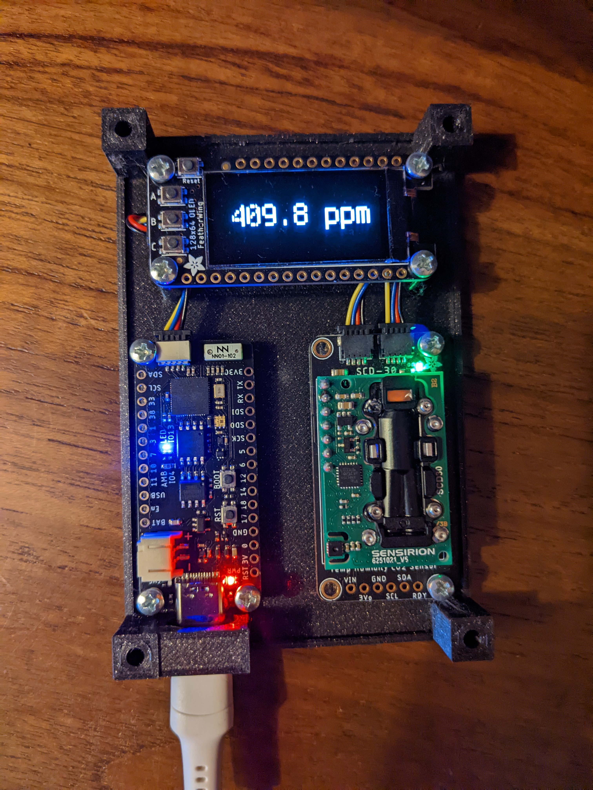

# FeatherS2 - ESP32-S2 CO2 monitoring project

This DIY air quality monitor will measure:

* temperature
* humidity
* pressure
* CO2

Derivated from [Dheera Venkatraman air quality monitor project](https://github.com/dheera/aqi-monitor).

By default, results are uploaded to mqtt broker for serial database and visualisation tool integration.



### Enclosure

An STL file for 3D printing a case is in the [stl folder](stl/).
An scad file (OpenSCAD) is in the [scad folder](scad/). 

### Base set

* [Adafruit FeatherS2 - ESP32-S2](https://www.adafruit.com/product/4769)
* [SeeedStudio SCD30](https://www.seeedstudio.com/Grove-CO2-Temperature-Humidity-Sensor-SCD30-p-2911.html)
* [Adafruit FeatherWing OLED - 128x64 OLED](https://www.adafruit.com/product/4650)

### Modify the parameters

1. Modify `config.py`. Enter your Wifi name (SSID) and password. The microcontroller needs WiFi access to be able to upload the sensor data.
2. Modify `config.py`. Enter MQTT broker address and topic.

### Load on the code

Plug the microcontroller into your computer using a USB-C cable. It should appear in your file explorer. Copy and replace the files including the files you modified into the `CIRCUITPY` folder. 

Do not include scad and stl directories.

Press reset. 

### Troubleshooting

From a terminal window, you can log into the Feather S2 microcontroller to read the logs using

```
sudo screen /dev/ttyACM0 115200
```
The actual device name might be different. This opens up a python terminal. You can re-run the code by typing `import code`.
